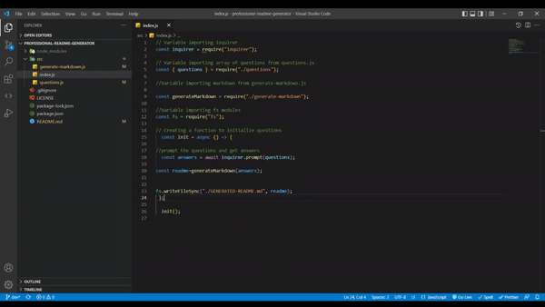

# Readme file generator 

This project uses node.js to create a command-line application that dynamically generates a professional README.md file from a user's input.


## Table of Contents

 
  - [Project Description](#description)
  - [Technologies](#technologies)
  - [Installation](#installation)
  - [Usage](#usage)
  - [License](#license)
  - [Tests](#tests)
  - [Author](#author)
  - [Contact](#contact)

## Project Description
This project uses node.js to create a command-line application that dynamically generates a professional README.md file from a user's input.

The user is asked series of prompt questions in the terminal about the information of their project.

After the user's submited responses, a markdown file will be dynamically generated and will include a bulleted table of contents (with navigation links), installation instructions, license type selected from a list as well as an email address and github information.


## Technologies

- Node.js 
- Node core package: fs (read/write into files)
- Node external package: inquirer (user prompts and answers)


## Installation

To install this project, please follow the instructions below:

Clone the repository, using SSH keys:
```
git clone git@github.com:nsharma-uk/professional-readme-generator.git
```
In the new repository install and run the required packages:
```

npm install
npm run start
```

## Demo video of the application



[Link](https://drive.google.com/file/d/16pi0ID0U9yTEYhjWp0E1126nElMcah9p/view?usp=sharing)

## License

MIT License

## Tests

Please follow the instructions below:

```
npm run test
```

## Author

N Sharma


## Questions

Please contact me on my email: [email](nsharmauk711@gmail.com) 

Visit my GitHub profile [here](https://github.com/nsharma-uk)


